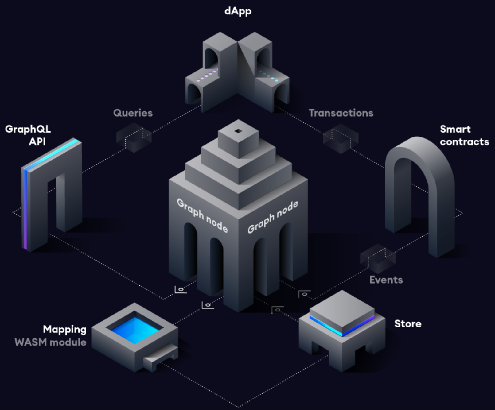

####  SubGraph
- [Описание](#%D0%BE%D0%BF%D0%B8%D1%81%D0%B0%D0%BD%D0%B8%D0%B5)
- [Как работает](#%D0%BA%D0%B0%D0%BA-%D1%80%D0%B0%D0%B1%D0%BE%D1%82%D0%B0%D0%B5%D1%82)
- [Запуск graph-node](#%D0%B7%D0%B0%D0%BF%D1%83%D1%81%D0%BA-graph-node)
- [Разработка и деплой subgraph](#%D1%80%D0%B0%D0%B7%D1%80%D0%B0%D0%B1%D0%BE%D1%82%D0%BA%D0%B0-%D0%B8-%D0%B4%D0%B5%D0%BF%D0%BB%D0%BE%D0%B9-subgraph)
- [Получение данных](#%D0%BF%D0%BE%D0%BB%D1%83%D1%87%D0%B5%D0%BD%D0%B8%D0%B5-%D0%B4%D0%B0%D0%BD%D0%BD%D1%8B%D1%85)
- [Ccылки](#%D1%81%D1%81%D1%8B%D0%BB%D0%BA%D0%B8)
- [Публичные subgraph](#%D0%BF%D1%83%D0%B1%D0%BB%D0%B8%D1%87%D0%BD%D1%8B%D0%B5-subgraph)

# Описание

**Graph Network** - это децентрализованный протокол индексации для организации данных блокчейна. Приложения используют GraphQL для запроса открытых API, называемых **subgraph**, для извлечения данных, индексируемых в сети. С помощью **The Graph** разработчики могут создавать бессерверные приложения, которые полностью работают в общедоступной инфраструктуре.

Graph узнает, что и как индексировать данные Ethereum на основе описаний subgraph, известных как манифест подграфов. Описание subgraph определяет смарт-контракты, представляющие интерес для subgraph, события в этих контрактах, на которые следует обратить внимание, и способ сопоставления данных события с данными, которые Graph будет хранить в своей базе данных.

После того, как вы написали манифест subgraph, вы используете Graph CLI, чтобы сохранить определение в IPFS и сообщить размещенной службе начать индексирование данных для этого подграфа.

# Как работает

Эта диаграмма дает более подробную информацию о потоке данных после развертывания манифеста подграфа, связанного с транзакциями Ethereum:

Поток следует за этими шагами:

- **Децентрализованное приложение (DAPP)** добавляет данные в Ethereum посредством транзакции смарт-контракта.
- Смарт-контракт генерирует одно или несколько событий при обработке транзакции.
- **Graph Node** постоянно сканирует Ethereum на предмет новых блоков и данных для вашего subgraph, которые они могут содержать.
- **Graph Node** находит события Ethereum для вашего **subgraph** в этих блоках и запускает обработчики отображений, которые вы предоставили. Сопоставление - это модуль WASM, который создает или обновляет объекты данных, которые **Graph Node** хранит в ответ на события Ethereum.
- Децентрализованное приложение запрашивает у **Graph Node** данные, проиндексированные из блокчейна, используя GraphQL. **Graph Node**, в свою очередь, переводит запросы GraphQL в запросы для своего базового хранилища данных, чтобы получить эти данные, используя возможности индексирования хранилища.
- Децентрализованное приложение  (DAPP) отображает эти данные в удобном пользовательском интерфейсе для конечных пользователей, который они используют для выполнения новых транзакций в Ethereum. Цикл повторяется.

# Запуск graph-node
Несколько способов:

- [Готовый hosting graph-node The graph](The-graph.md)

- [Запуск graph-node c публичным RPC JSON](graph-node-with-public-RPC.md)

- [Запуск graph-node c full node сети](graph-node-c-full-node.md)

- [Запуск graph-node с использованием ganache-cli](Graph-node-c-ganache.md)

# Разработка и деплой subgraph
- [Краткая инструкция и ссылки на документацию](Developing-and-deploying-subgraph.md)

## Получение данных
- [Краткое описание запросов к graph-node](https://thegraph.com/docs/en/developer/query-the-graph/)
- [Более подробное описание запросов/api graph-node](https://thegraph.com/docs/en/developer/graphql-api/#queries)

# Ccылки

- [The Graph](https://thegraph.com)
- [graph-node](https://github.com/graphprotocol/graph-node)

# Публичные subgraph
- [sushi](https://github.com/sushiswap/sushiswap-subgraph)
- [uniswap2](https://github.com/Uniswap/uniswap-v2-subgraph)
- [uniswap3](https://github.com/Uniswap/uniswap-v3-subgraph) 
